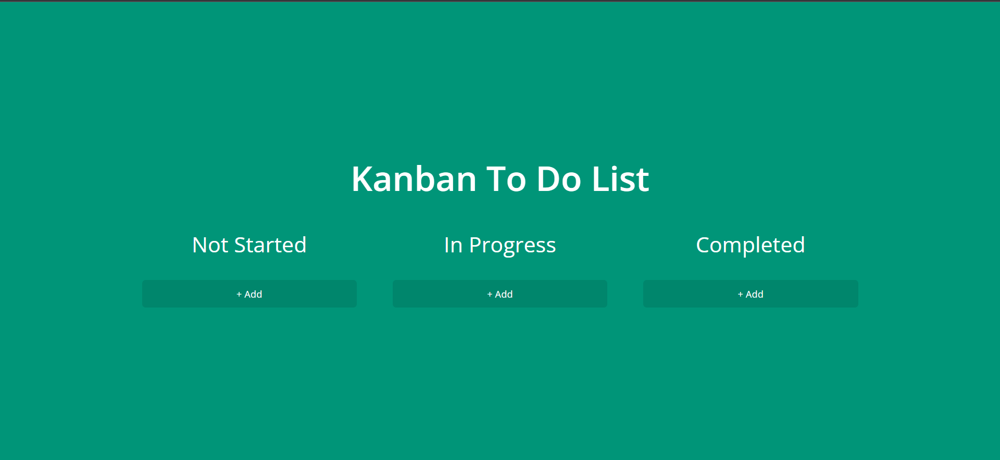

<h1>
#####Kanban To-Do List Project#######
</h1>

<h2>
**This project is a Kanban-style to-do list application built using HTML, CSS, and JavaScript.
</h2>

<h3>
**The application allows users to create, edit, and delete tasks,
 
**and to move tasks between different stages of completion.
</h3>

<h2>
######Installation
</h2>

**To use the application, simply clone or download the repository to your local machine.

**Then, open the index.html file in your preferred web browser.

<h2>
#######Usage
</h2>

**To add a task, click the "Add Task" button and fill out the form.

**You can then edit or delete the task as needed.

<h2>
#######To move a task between stages,
</h2>
**simply drag and drop the task card to the appropriate column.

**Tasks are grouped into three columns: "To Do," "In Progress," and "Done."

<h2>
######Contributing
</h2>

**Contributions to the project are welcome! 

**If you would like to contribute, please fork the repository and create a pull request with your changes.

<h2>
######Credits
</h2>
**This project was created by Yousef Maher Elkhayat.
<h2>
#License
</h2>
 All rights reserved © 2023
